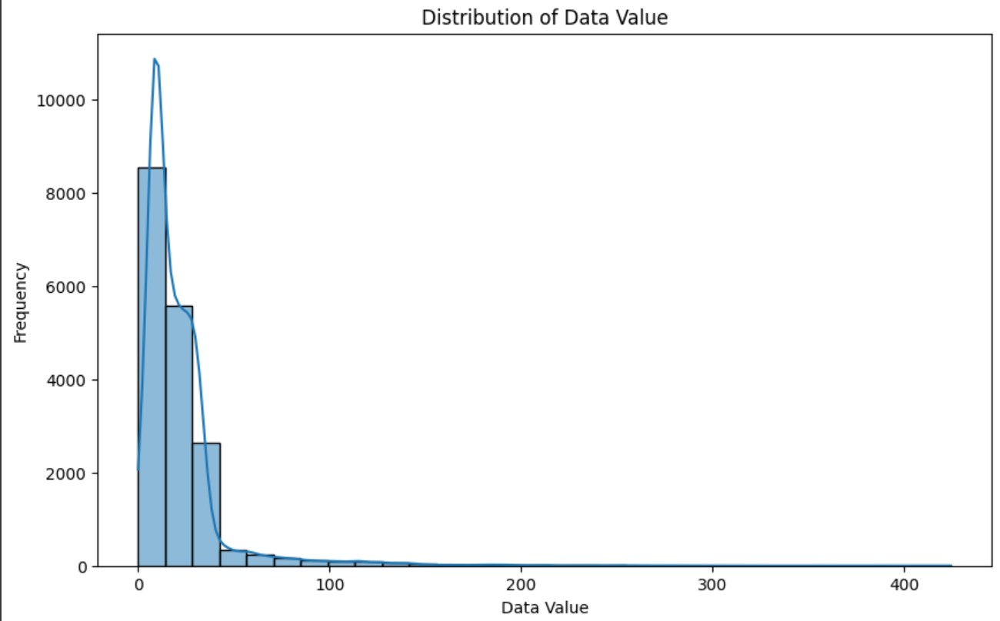
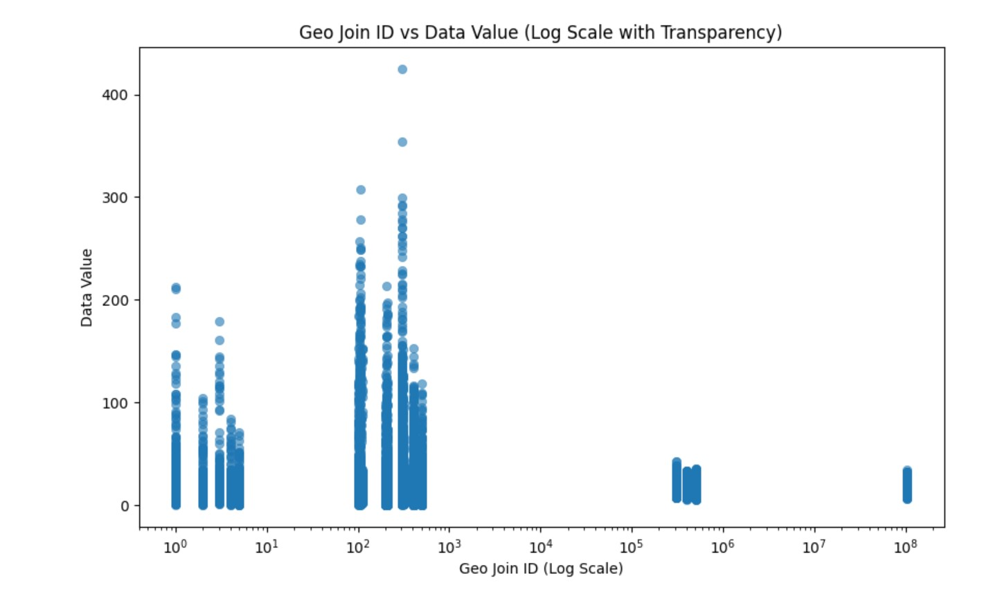

# Air Quality of NYC

## Project Description
This project analyzes air quality data across time and geographies of New York City, by the use of this dataset the most common air pollutants or exposure of the population caused by bad emissions of different sources we would be able to visualize and analyze the factors the circle around this air pollution problem.

## Dataset Description
The dataset used for this project is sourced from the New York City Open Data portal (https://data.cityofnewyork.us/api/views/c3uy-2p5r/rows.csv) from (https://catalog.data.gov/dataset/air-quality/resource/f3ed1638-92da-4f88-bb6b-7d3940514574) and provides comprehensive information on air quality metrics across various geographic locations and time periods. It includes key attributes such as 'Geo Join ID', 'Geo Place Name', 'Start_Date', and 'Data Value', which represent the geographical identifiers, location names, measurement dates, and the air quality values, respectively. This dataset is crucial for understanding the spatial and temporal distribution of air quality indicators, enabling insights into the factors contributing to air pollution in New York City.

## Summary of Findings
The analysis of the air quality dataset revealed several key findings. Firstly, the distribution of 'Data Value' showed a significant concentration around certain values, indicating common air quality levels. The time series analysis highlighted temporal trends, with notable fluctuations in air quality over different periods. The geographical analysis identified specific regions with consistently higher or lower air quality values, suggesting areas of concern and potential hotspots. The scatter plot further illustrated the relationship between geographic locations and air quality, revealing clusters and outliers that could guide targeted interventions.

## Data Preprocessing
The data preprocessing starts by removing rows with missing values in the 'Geo Join ID' and 'Data Value' columns to ensure a clean dataset for analysis. The 'Start_Date' column is converted into a datetime format to enable any future time-based operations. Before dropping irrelevant columns, a check is performed to ensure the columns 'Message' and 'Indicator ID' exist, avoiding errors if they are not present. The resulting dataset is split into features (X) and the target variable (y), preparing it for further modeling and analysis.

## Exploratory Data Analysis
The data visualization starts with a histogram of the target variable, Data Value, which reveals its distribution and highlights any common values, outliers, or skewness in the dataset. Next, a time series line plot illustrates the changes in Data Value over time, helping to detect any trends, patterns, or anomalies across different periods. Following that, a bar plot compares the top 10 geographical regions (Geo Place Names) by their average Data Value, making it easy to spot which areas are most affected or have the highest values. Finally, a scatter plot explores the relationship between geographic regions, represented by Geo Join ID, and their corresponding Data Value, revealing any clusters or outliers that may indicate interesting patterns across different locations.

## Visualization

## Model Development
The model development process involved the use of four distinct regression algorithms such as Linear Regression, Decision Tree Regressor, Random Forest Regressor, and Gradient Boosting Regressor. Each model was trained on the preprocessed dataset, which included handling missing values, converting date formats, and encoding categorical variables. The Gradient Boosting Regressor was further optimized through hyperparameter tuning using GridSearchCV to achieve the best possible performance. This multi-model approach ensured a comprehensive evaluation of the dataset's predictive capabilities across different modeling techniques.t.

## Model Evaluation
The model evaluation process focused on assessing the performance of each regression model using the R-squared metric, which measures the proportion of variance in the target variable that is predictable from the features. The evaluation results showed varying levels of accuracy across the models, with the Gradient Boosting Regressor, after hyperparameter tuning, demonstrating the highest R-squared value. This indicates its superior ability to predict air quality values based on the given features. The evaluation process underscored the importance of model selection and tuning in achieving optimal predictive performance.

## Conclusion
In conclusion, this project provided valuable insights into the air quality dynamics of New York City through detailed data analysis and visualization. The findings highlighted temporal and spatial patterns in air quality, identified key regions of concern, and demonstrated the effectiveness of different regression models in predicting air quality values. The Gradient Boosting Regressor, with its optimized hyperparameters, emerged as the most accurate model, suggesting its potential for practical applications in air quality forecasting and policy-making. These insights can inform targeted strategies to mitigate air pollution and improve public health outcomes in the city. The best R-squared value of 0.9558 was achieved by the Gradient Boosting Regressor after hyperparameter tuning. This high R-squared indicates that the model explains 95.58% of the variance in the target variable, which is a strong performance. 